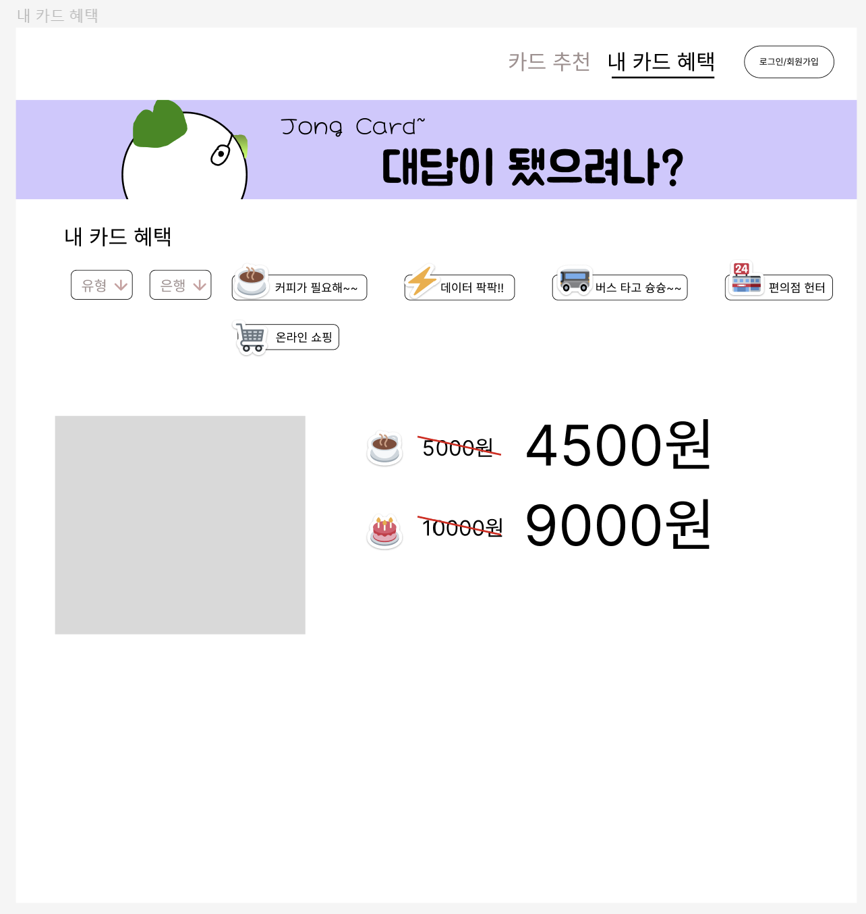
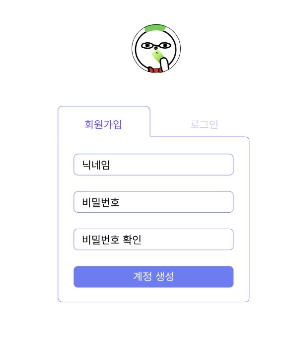
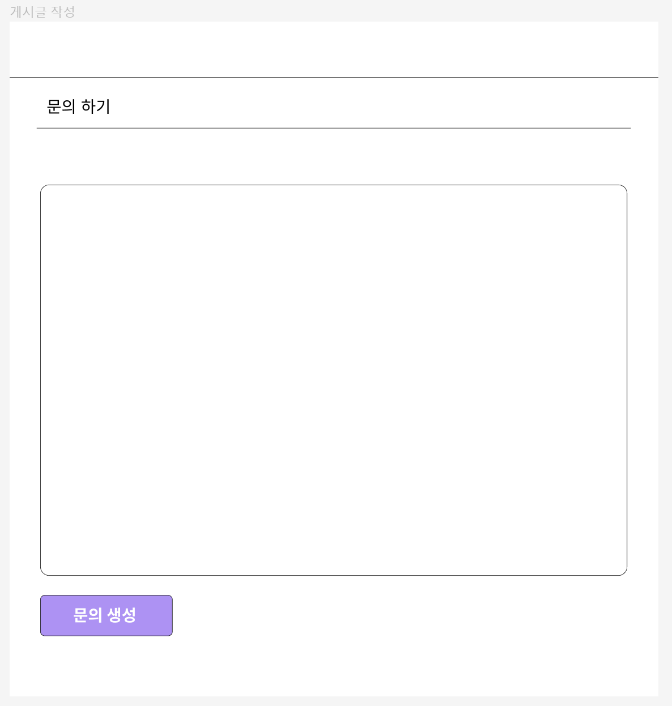

## 목차
### [Skills](#skills)  |  [기획](#1-기획)  |  [목업](#2-목업디자인)

## Skills
### Back

### Front

## 1. 기획
> 카드 혜택 별 추천 웹 사이트

### 주요 기능
#### `1. 할인율 시각적으로 보여주기`
- 각 혜택별로 얼마나 할인이 되는지를 대표 제품의 가격으로 확인할 수 있게 만들자!
> ex ) 커피: ~~5000원~~    = 4500원 
 
#### `2. 정렬 기능` 
- 카드사
- 카드 혜택 유/무 
- 좋아요순
  
#### `3. 로그인 / 회원가입 기능`
- 로그인/회원가입 기능은 필수!

#### `4. 문의글 작성하기 - (로그인 필요)`
- 로그인한 사용자가 궁금한 점을 문의할 수 있는 문의글 게시판을 만들자!
- 정렬 기능 추가 `(고려)`

#### `5. 카드 키우기`
- 사이트에 사용 시간을 늘리기 위해서 고안한 기능
- 미션을 수행하면 카드에 경험치를 획득할 수 있음
- 레벨업 할때마다 이미지를 변경시켜 새로움을 느끼게 할 예정

## 2. 목업(디자인)
### `메인 페이지`

- 네비게이션바는 최대한 심플하게 갈 예정
- 헤더부분은 `캐러셀`을 구현하여 추천 카드를 보여줄 예정
- 주요 기능들에 들어갈 수 있는 아이콘을 만든다
- 공지사항과 문의글을 볼 수 있는 영역을 밑에 둔다 `(변경 가능)`

### `광고 헤더`

- `JongCard`의 시그니처 캐릭터를 활용하여 광고성 헤더`(슬라이드 이미지 활용)`를 만들 예정

### `카드 추천 및 혜택 정렬 페이지`

  - 상단에 각 혜택별로 선택할 수 있는 버튼을 만든다
  - 버튼을 누르면 해당 혜택이 있는 카드를 정렬해서 다시 나타낸다
  - 각 카드별 좋아요 버튼도 넣을 예정!

### `카드 혜택 상세페이지`

- 혜택별 대표 상품을 할인율에 따라 가격차이를 시각적으로 보여준다
- 혜택이 없는 메뉴는 비활성화

### `로그인/회원가입`

> 회원가입: 닉네임, 비밀번호, 비밀번호확인
>
> 로그인: 닉네임, 비밀번호
- 회원가입과 로그인 버튼을 누르면 각각에 입력해야할 창이 바뀌게 할 예정

### `카드 키우기`

- 카드를 누르면 동전이 떨어지는 효과
- 미션을 수행하면 경험치 증가
- 레벨업을 하면 카드가 바뀜

### `문의글 게시판`
 

- 심플하게 만들 예정!
- 더미 데이터를 추가하여 여러 페이지를 만들어서 넘어가게 만들 `예정`

